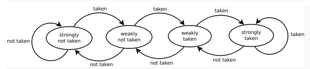

# Branch Predictor Using Perceptron

------

In computer architecture, a branch predictor is a digital circuit that tries to guess which way a branch (e.g. an if–then–else structure) will go before this is known definitively. The purpose of the branch predictor is to improve the flow in the instruction pipeline. Branch predictors play a critical role in achieving high effective performance in many modern pipelined microprocessor architectures, such as x86.

For this project, we use 2-bit saturating counter. It is a state machine with four states.

### Achievement

| DataSet | GShare:13   |  Tournament:9:10:10  | Custom:15:15:10  | 
| --------   | ----:  | ----:  | ----:  |
| fp_1    | 0.825 | 0.991 | 0.823 |
| fp_2    | 1.678 | 3.246 | 0.199 |
| int_1   | 13.839 | 12.622 | 8.907 |
| int_2   | 0.420 | 0.426 | 0.269 |
| mm_1   | 6.696 | 2.581 | 2.066 |
| mm_2   | 10.138 | 8.438 | 5.762 |

### Perceptron Predictor
 Refer to this [Paper](https://www.cs.utexas.edu/~lin/papers/hpca01.pdf)

